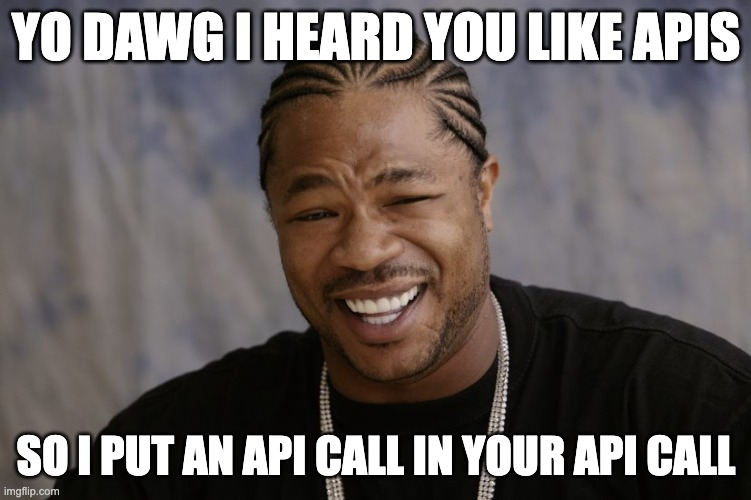

# Chat2Meme

_A ChatGPT-based meme generator. Is this a good idea? No! But did I do it anyway? You betcha!_

This application is built off the [Beginner Chat API Frontend](https://github.com/bildungsroman/beginner-chat-api) and adds another API call, this time to the [Imgflip API](https://imgflip.com/api).

Why? Because memes!



## Getting started

These instructions assume you already have an OpenAI account and an ImgFlip account. If you don't, go to [openai.com](https://openai.com/) and [imgflip.com](https://imgflip.com/) and create one!

1. Clone this repo (if you have the GitHub CLI, it's as easy as `gh repo clone bildungsroman/beginner-chat-api`)
2. `cd beginner-chat-api && npm install`
3. Go to [your API keys](https://platform.openai.com/account/api-keys) in OpenAI and click `Create new secret key`. Copy your new key.
4. Create an `.env` file in the root of the directory and set your new key there:
   `echo VITE_OPENAI_API_KEY=<Your API Key here> > .env`
5. Open the `.env` file and add:

```bash
VITE_IMGFLIP_API_USERNAME=<Your username here>
VITE_IMGFLIP_API_PASSWORD=<Your password here>
```

6. Run `npm run dev` and you should be able to open your app locally and start interacting with the prompts. If you encounter any errors, there are some `console.log()`s you can uncomment in `src/utils/callChatAPI.ts` to help you debug issues.

And that's it! This is just to get you started building an app that utilizes the ChatGPT API - just imagine the possibilities 🪄🧙🦄

**Standard please don't sue me if you go broke disclaimer**: You may need to upgrade your OpenAI account or add credits to use the API if you have a free account. Please don't go overboard, they really don't need your money at this point.
